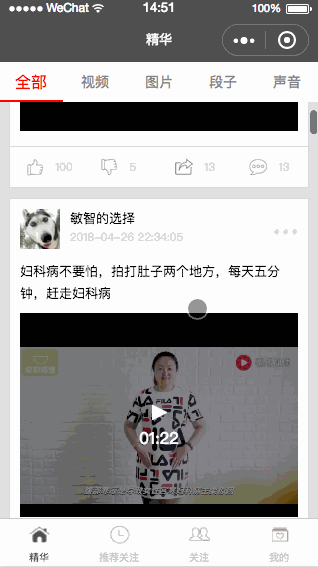

# SYDemo_WeChatBaiSi
The project BaiSi is a WeChat program...
百思项目是一个微信小程序demo...

`WeChat小程序交流（QQ群：769977169）`

### 功能预览效果图




### 功能说明
* 精华
  * 全部
    * 评论详情
  * 视频
    * 评论详情
  * 图片
    * 评论详情
  * 段子
    * 评论详情
  * 声音
    * 评论详情
* 推荐关注
  * 一级分类
  * 二级分类
* 关注
* 我的
  * 登录注册
    * 注册
    * 忘记密码
  * 离线下载
  * 类别
  
### 功能接口
* 精华
  * 接口地址
    * 第一页：http://api.budejie.com/api/api_open.php?a=list&c=data&type=1
    * 第N页：http://api.budejie.com/api/api_open.php?a=list&c=data&type=1&page=2&maxtime=1524801421
  * 请求方式：get
  * 参数
    * type
      * 全部：1
      * 视频：41
      * 图片：10
      * 段子：29
      * 声音：31
    * page：第2页分页时需要
    * maxtime：第2页分页时需要，值来源于上一次请求结果中信息，如：info.maxtime
  * 请求结果：json
  
```
{
    "info": {
        "vendor": "six.jie.c",
        "count": 2000,
        "page": 100,
        "maxid": "1524805802",
        "maxtime": "1524805802"
    },
    "list": [
        {
            "id": "27749251",
            "type": "41",
            "text": "小小池塘里也能长出100斤的大鱼？",
            "user_id": "15193277",
            "name": "夕阳画匠",
            "screen_name": "夕阳画匠",
            "profile_image": "http://wimg.spriteapp.cn/profile/large/2017/11/12/5a074a664d4e3_mini.jpg",
            "created_at": "2018-04-27 15:01:02",
            "create_time": "2018-04-26 18:02:31",
            "passtime": "2018-04-27 15:01:02",
            "love": "111",
            "hate": "13",
            "comment": "28",
            "repost": "11",
            "bookmark": "2",
            "bimageuri": "http://wimg.spriteapp.cn/picture/2018/0426/27749251_102.jpg",
            "voiceuri": "",
            "voicetime": "0",
            "voicelength": "0",
            "status": "4",
            "theme_id": "55163",
            "theme_name": "主版块",
            "theme_type": "1",
            "videouri": "http://wvideo.spriteapp.cn/video/2018/0426/5ae1a3b78ca2a_wpd.mp4",
            "videotime": "92",
            "original_pid": "0",
            "cache_version": 2,
            "playcount": "6135",
            "playfcount": "1021",
            "cai": "13",
            "top_cmt": [ ],
            "weixin_url": "http://a.f.winapp111.com.cn/share/27749251.html?wx.qq.com&appname=",
            "themes": [ ],
            "image1": "http://wimg.spriteapp.cn/picture/2018/0426/27749251_102.jpg",
            "image2": "http://wimg.spriteapp.cn/picture/2018/0426/27749251_102.jpg",
            "is_gif": "0",
            "image0": "http://wimg.spriteapp.cn/picture/2018/0426/27749251_102.jpg",
            "image_small": "http://wimg.spriteapp.cn/picture/2018/0426/27749251_102.jpg",
            "cdn_img": "http://wimg.spriteapp.cn/picture/2018/0426/27749251_102.jpg",
            "width": "320",
            "height": "568",
            "tag": "",
            "t": 1524812462,
            "ding": "111",
            "favourite": "2"
        },
        ......
    ]
}
```
  
* 评论详情
  * 接口地址
    * 第一页：http://api.budejie.com/api/api_open.php?a=dataList&c=comment&data_id=27749909
    * 第N页：http://api.budejie.com/api/api_open.php?a=dataList&c=comment&data_id=27749909&page=2&lastcid=1293566
  * 请求方式：get
  * 参数
    * data_id：来源于上一个页面中被点击的对象的id值
    * page：第2页分页时需要
    * lastcid：第2页分页时需要，值来源于第1页结果数组中的最后一个对象的id值
  * 请求结果：json

```
{
    "total": 21,
    "data": [
        {
            "data_id": "27749909",
            "status": "0",
            "id": "1332090",
            "content": "如果耐，请深耐",
            "ctime": "2018-04-27 10:48:55",
            "precid": "1330732",
            "preuid": "12745266",
            "like_count": "1",
            "voiceuri": "",
            "voicetime": "",
            "cmt_type": "29",
            "user": {
                "id": "14507435",
                "username": "何小健呀",
                "sex": "m",
                "profile_image": "http://wimg.spriteapp.cn/profile/large/2018/04/23/5addab71eea23_mini.jpg",
                "weibo_uid": "",
                "qq_uid": "",
                "qzone_uid": "C97D0319A84386C04046920E1AF35B91",
                "is_vip": false,
                "personal_page": "http://user.qzone.qq.com/C97D0319A84386C04046920E1AF35B91",
                "total_cmt_like_count": "943"
            },
            "precmt": {
                "data_id": "27749909",
                "status": "0",
                "id": "1330732",
                "content": "如果爱，请深爱",
                "ctime": "2018-04-27 10:25:25",
                "precid": "1299738",
                "preuid": "22384878",
                "like_count": "4",
                "voiceuri": "",
                "voicetime": "",
                "cmt_type": "29",
                "user": {
                    "id": "12745266",
                    "username": "赵菓菓",
                    "sex": "f",
                    "profile_image": "http://wimg.spriteapp.cn/profile/large/2018/04/18/5ad6f4ba0da76_mini.jpg",
                    "weibo_uid": "",
                    "qq_uid": "",
                    "qzone_uid": "B091E2EA12542FAC740ED590E529D0DD",
                    "is_vip": false,
                    "personal_page": "http://user.qzone.qq.com/B091E2EA12542FAC740ED590E529D0DD",
                    "total_cmt_like_count": "462"
                }
            }
        },
        ....
    ]
}
```

* 推荐关注
  * 接口地址
    * 一级分类：http://api.budejie.com/api/api_open.php?a=category&c=subscribe
    * 二级分类：
      * 第一页：http://api.budejie.com/api/api_open.php?a=list&c=subscribe&category_id=35&page=1
      * 第N页：http://api.budejie.com/api/api_open.php?a=list&c=subscribe&category_id=35&page=2
  * 请求方式：get
  * 参数
    * category：一级分类id
    * page：分页时需要，取值1~N
  * 请求结果：json
  
```
// 一级分类
{
    "info": {
        "count": 10,
        "np": 20
    },
    "total": 10,
    "list": [
        {
            "count": 65,
            "id": 35,
            "name": "网红"
        },
        {
            "count": 40,
            "id": 33,
            "name": "工作室"
        },
        ...
    ],
    "size": 10
}
```

```
// 二级分类
{
    "count": 97,
    "next_page": 2,
    "total": 97,
    "list": [
        {
            "fans_count": 150,
            "header": "http://qzapp.qlogo.cn/qzapp/100336987/77E390189F833E418E21320ADC2EFFC5/100",
            "uid": 21109676,
            "is_vip": false,
            "is_follow": 0,
            "introduction": "",
            "gender": 1,
            "tiezi_count": 75,
            "screen_name": "O乐"
        },
        {
            "fans_count": 153,
            "header": "http://wimg.spriteapp.cn/profile/large/2017/09/23/59c5d91af00f7_mini.jpg",
            "uid": 21125653,
            "is_vip": false,
            "is_follow": 0,
            "introduction": "",
            "gender": 1,
            "tiezi_count": 10,
            "screen_name": "沈阳潮人邦"
        },
        ...
    ],
    "total_page": 5
}
```
  
